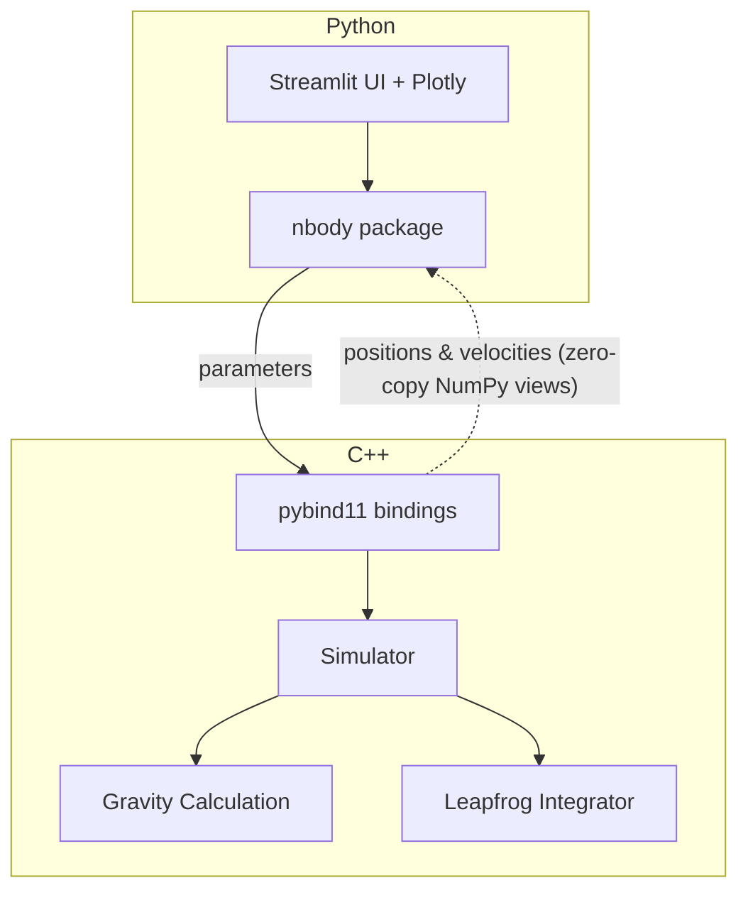

# N-Body Gravity Simulation

A real-time gravitational N-body simulation with a C++ physics engine and a Streamlit web interface.

<!-- TODO: Add a GIF of the simulation running -->

<!-- TODO: Uncomment when deployed -->
<!-- **[Live Demo](https://your-app.streamlit.app)** -->

## Quickstart

```bash
git clone https://github.com/denniszubov/n-body-gravity-simulation.git
cd n-body-gravity-simulation
python -m venv .venv && source .venv/bin/activate
make build
make run
```

## How It Works

The physics runs entirely in C++. Python handles the UI and visualization.



**C++ does:** gravitational force calculation, leapfrog integration, energy tracking, step timing

**Python does:** UI controls, preset initialization, Plotly rendering

Positions and velocities are returned to Python as NumPy views pointing directly into C++ memory — no copying.

## Presets

| Preset | Description |
|--------|-------------|
| Two-Body Orbit | Two equal masses in a stable circular orbit |
| Random Disk | N bodies orbiting a central mass |
| Solar System | A star with 6 planets at various distances |

## Project Structure

```
cpp/                  C++ physics engine
  include/nbody/      Headers
  src/                Implementations + pybind11 bindings
python/nbody/         Python package (presets, re-exports)
app/                  Streamlit web app
tests/                pytest suite
```

## Build System

The project uses CMake + [scikit-build-core](https://github.com/scikit-build/scikit-build-core) so the C++ extension compiles automatically via `pip install`.

| Command | What it does |
|---------|-------------|
| `make build` | Compile C++ and install the package |
| `make run` | Launch the Streamlit app |
| `make test` | Run the test suite |

## Physics

- **Gravity:** Newtonian gravitational force with a softening parameter to avoid singularities
- **Integrator:** Leapfrog (kick-drift-kick) — an integrator that conserves energy over long simulations

## API

```python
from nbody import Simulator, Config, random_disk

sim = random_disk(n=500, seed=42)
sim.step(dt=0.005, n_steps=100)

pos = sim.positions()   # (N, 2) NumPy array, zero-copy view
energy = sim.total_energy()
```
